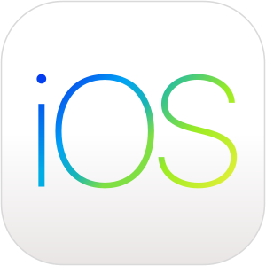

# ЕЛЕНА  ЛЫСЕНСКАЯ

*ПРОФЕССИОНАЛЬНЫЙ ОПЫТ:* 05.2022 – настоящее время Учебные проекты в Нетологии
курс iOS-разработчик.

КЛЮЧЕВЫЕ КОМПЕТЕНЦИИ:
* Программирование на Swift
* Применение объектно-ориентированного дизайна
* Работа с GIT
